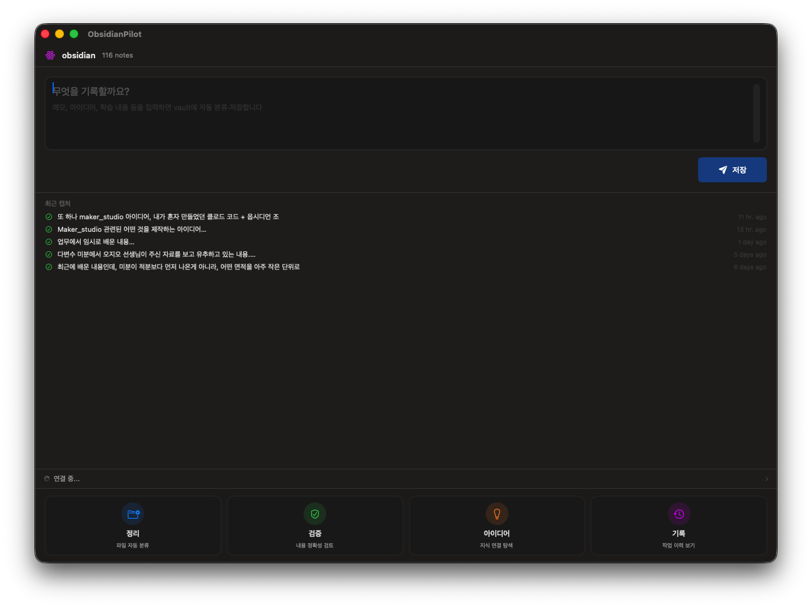
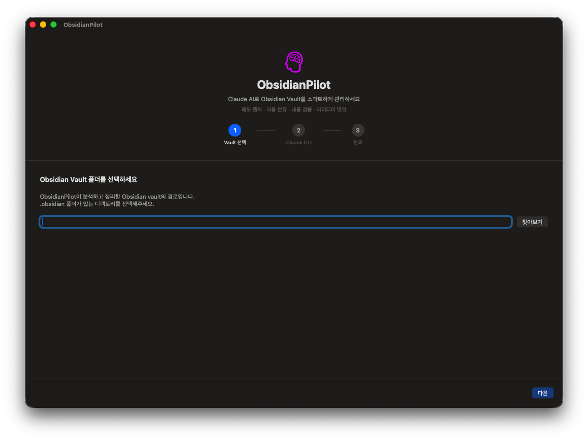

# ObsidianPilot

> Claude Code CLI를 활용하여 Obsidian Vault를 스마트하게 관리하는 macOS 네이티브 앱



## What is ObsidianPilot?

ObsidianPilot은 **Claude AI**의 힘을 빌려 Obsidian vault를 더 똑똑하게 관리해주는 macOS 앱입니다.

메모를 입력하면 자동으로 분류해서 vault에 저장하고, 기존 노트를 정리하거나, 내용을 검증하고, 노트 간 숨겨진 연결점까지 찾아줍니다.

### 핵심 기능

| 기능 | 설명 |
|------|------|
| **캡처** | 메모를 입력하면 Claude가 자동 분류하여 vault에 저장 |
| **정리** | vault 파일을 카테고리별로 자동 분류 및 정리 |
| **검증** | 노트 내용의 정확성, 논리적 일관성을 AI가 검토 |
| **아이디어** | 노트 간 연결점 발견, 학습 갭 분석, 크로스 카테고리 인사이트 |
| **기록** | 모든 AI 작업 세션의 이력 관리 |

그 외: 실시간 스트리밍 미리보기, 메뉴바 빠른 접근, Claude 사용량 모니터링

---

## Quick Start

### 1. 사전 준비

| 항목 | 요구사항 |
|------|----------|
| macOS | 14.0 (Sonoma) 이상 |
| Xcode | 16.0 이상 (소스 빌드 시) |
| Obsidian | vault 폴더가 설정되어 있어야 함 |
| Claude Code CLI | `claude` 명령어가 터미널에서 실행 가능해야 함 |

**Claude Code CLI 설치:**
```bash
npm install -g @anthropic-ai/claude-code
```
> Claude Pro 또는 Max 구독이 필요합니다. [설치 가이드](https://docs.anthropic.com/en/docs/claude-code)

### 2. 설치

#### DMG로 바로 설치 (빌드 없이)

[Releases](https://github.com/donggook-me/ObsidianPilot/releases) 페이지에서 `ObsidianPilot.dmg`를 다운로드하세요.

1. DMG 파일을 열고 앱을 **Applications** 폴더로 드래그
2. 첫 실행 시 GateKeeper가 차단하면 터미널에서:
   ```bash
   xattr -cr /Applications/ObsidianPilot.app
   ```
3. 앱 실행!

#### 소스에서 빌드

```bash
git clone https://github.com/donggook-me/ObsidianPilot.git
cd ObsidianPilot
open ObsidianPilot.xcodeproj
# Xcode에서 Run (⌘R)
```

또는 커맨드라인으로:
```bash
xcodebuild -project ObsidianPilot.xcodeproj -scheme ObsidianPilot -configuration Release build
```

### 3. 초기 설정

앱을 처음 실행하면 3단계 온보딩이 진행됩니다:



1. **Vault 선택** - Obsidian vault 폴더 경로를 지정 (`.obsidian` 폴더가 있는 디렉토리)
2. **Claude CLI 설정** - Claude CLI 경로 확인 (대부분 자동 감지됨)
3. **연결 테스트** - Claude가 정상 동작하는지 확인

> 설정은 나중에 **Settings** (`⌘,`)에서 언제든 변경 가능합니다.

---

## 사용법

### 캡처 (메인 기능)

1. 메인 화면에서 메모할 내용을 입력
2. **저장** 버튼 클릭 (또는 `⌘+Return`)
3. Claude가 내용을 분석 → 적절한 카테고리로 분류 → vault에 저장

### 도구 기능

메인 화면 하단의 4개 도구 버튼을 클릭하면 각 기능의 전체 화면으로 전환됩니다:

- **정리** - 카테고리를 선택하고 실행하면 vault 파일을 자동 정리. 후속 지시도 가능
- **검증** - 최근 파일 목록에서 선택 → AI가 내용의 정확성을 검토하여 피드백 제공
- **아이디어** - 대화형으로 vault의 지식 연결점을 탐색. 프리셋으로 빠른 시작 가능
- **기록** - 모든 AI 작업 이력을 확인하고 결과를 다시 볼 수 있음

뒤로 가려면 상단의 **< 캡처** 버튼을 클릭하세요.

### 메뉴바

상단 메뉴바의 🧠 아이콘을 클릭하면 빠른 접근 팝오버가 표시됩니다. 앱 윈도우를 열지 않고도 빠르게 작업을 실행할 수 있습니다.

---

## 동작 원리

ObsidianPilot은 [Claude Code CLI](https://docs.anthropic.com/en/docs/claude-code)를 `--output-format stream-json` 옵션으로 실행하여 AI 기능을 제공합니다.

```
사용자 입력 → vault 구조 분석 → Claude에 프롬프트 전송 → 실시간 스트리밍 → 결과 렌더링
```

- Claude가 vault 내에서 파일을 직접 생성/이동/수정합니다
- 모든 응답은 마크다운 + 수식(KaTeX)으로 렌더링됩니다
- 세션 비용, 토큰 사용량이 하단 Claude 상태 패널에 표시됩니다

---

## 프로젝트 구조

```
ObsidianPilot/
├── ObsidianPilotApp.swift    # 앱 진입점, AppState, AppDelegate
├── Models/
│   ├── Session.swift          # 작업 세션 데이터 모델
│   └── VaultFile.swift        # Vault 파일 모델 + 카테고리 매핑
├── Services/
│   ├── ClaudeService.swift    # Claude CLI 연동 (스트리밍)
│   ├── VaultService.swift     # Obsidian Vault 파일 관리
│   ├── SessionStore.swift     # 세션 이력 저장소
│   └── SettingsService.swift  # 설정 관리 (UserDefaults)
├── ViewModels/                # 각 기능별 비즈니스 로직
└── Views/                     # SwiftUI 화면 컴포넌트
```

## 문제 해결

| 문제 | 해결 방법 |
|------|-----------|
| Claude CLI를 찾을 수 없음 | `which claude`로 경로 확인 후 Settings에서 수동 지정 |
| "독립 모드"로 표시됨 | Claude CLI 경로 확인, `claude --version` 테스트, 구독 상태 확인 |
| 빌드 오류 | Xcode 16.0+ 확인, `File > Packages > Resolve Package Versions` |
| GateKeeper 차단 | `xattr -cr /Applications/ObsidianPilot.app` 실행 |

## 의존성

- [MarkdownUI](https://github.com/gonzalezreal/swift-markdown-ui) - 마크다운 렌더링

## License

MIT
